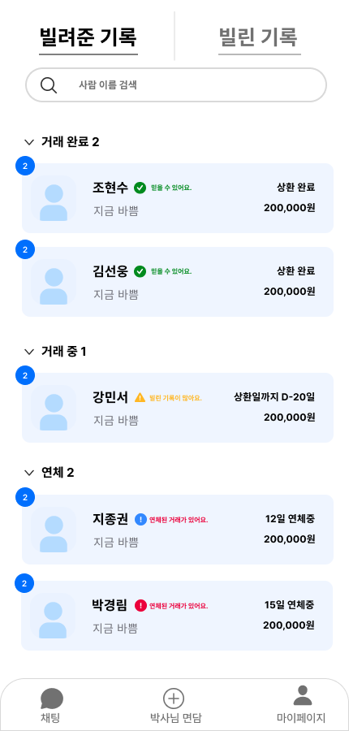
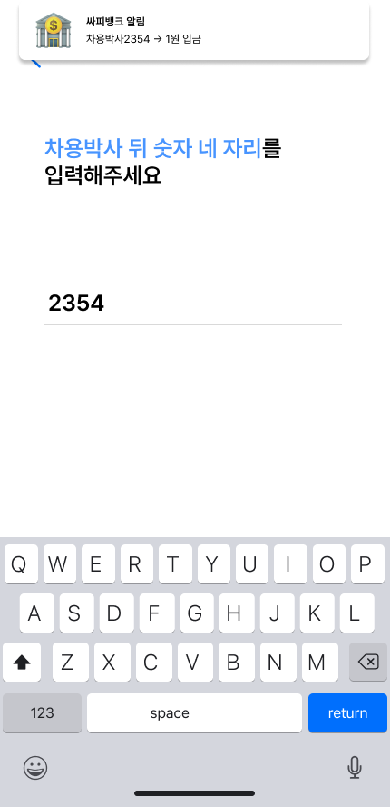

# 🏦 차용박사 - AI 기반 P2P 대출 중개 플랫폼

<div align="center">


> **AI가 만드는 신뢰성 있는 차용증, 에스크로로 안전한 금전 거래**  
> **개발기간: 2024.08.19 ~ 2024.10.11 (7주)**
</div>

## 📌 프로젝트 소개

### 🌟 기획 배경
현대 사회에서 개인 간 금전 거래는 일상적인 일이 되었지만, 여전히 많은 위험과 불편함을 동반합니다. 수기로 작성된 차용증은 법적 효력이 불확실하고, 개인 간 거래는 안전성을 보장받기 어려우며, 채무 불이행 시 적절한 대응 방안을 찾기 어렵습니다. 또한, 상환 일정과 내역 관리가 체계적으로 이루어지지 않아 분쟁의 소지가 높아지고 있습니다. 💸

특히 분할 상환의 경우, 매번 수기로 상환 내역을 기록하고 관리해야 하는 번거로움이 있으며, 종종 기록 누락이나 오류로 이어져 당사자 간 신뢰 관계를 해치는 원인이 되고 있습니다. 기존의 수기 장부 방식으로는 거래의 투명성을 보장하기 어렵고, 실시간으로 상환 현황을 확인하는 것도 현실적으로 불가능합니다. 📝

이러한 문제들을 해결하기 위해 차용박사는 AI 기술과 에스크로 시스템을 결합한 혁신적인 P2P 대출 중개 플랫폼을 제시합니다. 법적 효력이 있는 전자 차용증 발행부터 안전한 거래 시스템, 자동화된 상환 관리까지, 개인 간 금전 거래에 필요한 모든 요소를 포괄적으로 제공합니다. 🌟

차용박사는 단순한 금전 거래 플랫폼을 넘어, 개인 간 금전 거래의 새로운 패러다임을 제시합니다. 신뢰성, 안전성, 편의성을 핵심 가치로 삼아, 모든 사용자가 안심하고 이용할 수 있는 서비스를 만들어가고 있습니다. 앞으로도 차용박사는 사용자들의 피드백을 반영하며 지속적으로 서비스를 개선하여, 더 나은 금전 거래 문화를 만들어 나가겠습니다. 💪


## 👥 팀 소개

### 백엔드

|    지종권      |          조현수         |          박경림         |                                                                                                             
| :---: | :---: | :---: |
|       |       |       |
|   [@jijongkwon](https://github.com/jijongkwon)   |    [@HyunSoo730](https://github.com/HyunSoo730)  |    [@g16rim](https://github.com/g16rim)  |
| SSAFY | SSAFY | SSAFY |

### 프론트엔드

|    이지원      |          김선웅         |                                                                                                               
| :---: | :---: | 
|       |       |
|   [@LEEJW1953](https://github.com/LEEJW1953)   |    [@LineHero](https://github.com/LineHero)  |
| SSAFY | SSAFY |

### 인프라

|    지종권      |                                                                                                             
| :---: |
|       |
|   [@jijongkwon](https://github.com/jijongkwon)   |
| SSAFY |


## 🛠️ 기술 스택
<details>
<summary>
<h3 style="display: inline-block; color: #6DB33F;">💻 기술 스택 자세히 보기</h3>
</summary>
<div markdown="1">

### 💻 Language


### 🏗️ Framework & Library
#### 🔙 Backend


#### 🖼️ Frontend


### ⚙️ Config
#### 🖥️ Frontend


#### 🔧 Backend


### 🤝 Communication


### 🗄️ Database


### 🚀 DevOps


### 🎨 Etc


</div>
</details>

<br><br>

## 💪 주요 기능

### ⭐️ AI 차용증 자동 생성 및 관리
LLM 모델을 기반으로 사용자 간 대화 컨텍스트를 분석하고 법적 구속력을 갖춘 차용증을 자동 생성합니다. 실명 계좌 인증 시스템과 연동하여 거래 당사자의 신원을 검증하고, 안전한 온라인 저장소에서 차용증을 체계적으로 관리합니다. 모든 차용증은 법적 효력이 있는 PDF 형태로 제공되어 추후 법적 분쟁 발생 시 증빙 자료로 활용할 수 있습니다. 📝

#### 핵심 기능
- **AI 기반 차용증 작성**: 채팅 대화를 분석하여 자동으로 차용증 초안 작성
- **계좌 인증 시스템**: 1원 송금을 통한 실명 계좌 인증
- **문서 관리 체계**: 차용증 이력 관리 및 안전한 보관
- **PDF 변환**: 법적 효력이 있는 형태의 PDF 문서 출력 기능

### ⭐️ 안전한 거래 시스템
에스크로 기반의 안전한 거래 시스템을 통해 채권자와 채무자 모두를 보호합니다. 분할 상환 기능으로 유연한 거래가 가능하며, 모든 거래 내역은 실시간으로 기록됩니다. 🏦

#### 주요 특징
- **에스크로 시스템**: 안전한 중개 거래 보장
- **분할 상환 관리**: 체계적인 분할 상환 일정 관리
- **실시간 거래 추적**: 모든 거래 내역 실시간 기록

### ⭐️ 실시간 커뮤니케이션
거래 당사자 간의 원활한 소통을 위한 1:1 채팅 시스템을 제공합니다. 모든 채팅 내역은 안전하게 보관되며, 중요한 메시지는 즉시 알림을 통해 전달됩니다. 💬

#### 시스템 특징
- **1:1 채팅**: 거래 당사자 간 실시간 채팅 지원
- **채팅 히스토리**: 대화 내역 보관 및 검색 기능
- **알림 설정**: 맞춤형 알림 설정 기능

### ⭐️ 거래 현황 대시보드
직관적인 대시보드를 통해 진행 중인 모든 거래 현황을 한눈에 파악할 수 있습니다. 또한 거래 이력과 통계 기능을 함께 제공합니다. 📊

#### 핵심 기능
- **거래 목록**: 진행 중인 거래 목록 실시간 제공
- **상세 정보**: 각 거래별 상세 정보 조회

### ⭐️ 스마트 알림 센터
상환 일정, 입금 확인, 독촉 등 중요한 알림을 다양한 채널을 통해 전달합니다. 카카오톡과 앱 내 알림을 통해 중요한 정보를 놓치지 않도록 합니다. 🔔

#### 알림 기능
- **자동 알림**: 상환 기일 및 독촉 자동 알림
- **멀티 채널**: 앱 내 알림 및 카카오톡 알림 동시 지원
- **알림 설정**: 사용자(채권자) 맞춤형 알림 설정 기능

## 📱 화면 구성

<table>
  <tr>
    <td align="center" colspan="2"><b>💬 AI 기반 차용증 자동 생성</b></td>
  </tr>
  <tr>
    <td align="center" colspan="2">
      
      <br>
      <sub>대화 기반 실시간 차용증 작성 과정</sub>
    </td>
  </tr>
</table>

<table>
  <tr>
    <td align="center"><b>🏠 메인 화면</b></td>
    <td align="center"><b>📊 거래 내역</b></td>
  </tr>
  <tr>
    <td align="center">
      
      <br>
      <sub>직관적인 대시보드 화면</sub>
    </td>
    <td align="center">
      
      <br>
      <sub>상세한 거래 기록 관리</sub>
    </td>
  </tr>
</table>

<table>
  <tr>
    <td align="center"><b>📝 거래 목록</b></td>
    <td align="center"><b>🔐 계좌 인증</b></td>
  </tr>
  <tr>
    <td align="center">
      
      <br>
      <sub>진행 중인 모든 거래 현황 조회</sub>
    </td>
    <td align="center">
      
      <br>
      <sub>1원 인증을 통한 안전한 계좌 확인</sub>
    </td>
  </tr>
</table>

### 💡 주요 특징

- **실시간 차용증 작성**: AI가 대화를 분석하여 자동으로 차용증을 작성
- **직관적인 인터페이스**: 사용자 친화적인 UI/UX 설계
- **안전한 인증 시스템**: 1원 계좌 인증을 통한 신원 확인
- **상세한 거래 관리**: 모든 거래 내역을 한눈에 확인

## 🔧 내 역할(조현수) : 백엔드 시스템 구현 (거래 프로세스)

에스크로 기반의 P2P 금전 거래 시스템의 백엔드 아키텍처를 설계하고 구현했습니다. 특히 실시간 거래 처리와 데이터 정합성 보장에 중점을 두어 개발했습니다.

### 🏗️ 시스템 설계 및 구현

-> 아키텍처 사진 추가하기내 역할 (거래 프로세스) 작성 및 

#### 1. 거래 프로세스 아키텍처 설계
- **이벤트 기반 시스템**: 실시간 입금 감지 및 처리를 위한 Event Driven 아키텍처 구현
- **비동기 처리**: @EventListener와 @Async 활용한 효율적인 트랜잭션 처리
- **데이터 정합성**: 트랜잭션 관리를 통한 안전한 거래 보장

#### 2. 핵심 모듈 구현
- **가상계좌 관리**: 차용증과 1:1 매핑되는 가상계좌 시스템 구현
- **자동화된 이체**: 입금 감지부터 채권자 계좌 이체까지 자동화
- **상태 관리**: 차용증 상태 및 잔액 실시간 동기화

### 🔍 기술적 개선사항

#### 1. 시스템 최적화
- 폴링 방식에서 이벤트 기반 아키텍처로 전환하여 리소스 사용 효율화
- 중복 데이터 제거를 통한 API 응답 최적화
- 비동기 이벤트 처리로 시스템 성능 향상

#### 2. 데이터 처리 개선
- DTO 구조 최적화로 네트워크 부하 감소
- 효율적인 거래 내역 조회 시스템 구현
- 트랜잭션 관리 전략 수립 및 적용

### ⚡ 트러블 슈팅

#### 1. 주기적 폴링 방식의 리소스 낭비
```
Problem:
- 모든 활성 차용증의 가상계좌를 주기적으로 폴링하여 입금 확인
- 불필요한 API 호출 발생
- 시스템 리소스 과다 사용
- 실시간 처리 불가능

Solution:
- 이벤트 기반 아키텍처 도입
- 입금 발생 시에만 이벤트 발생 및 처리
- @EventListener와 @Async를 활용한 비동기 처리
- 실시간 처리 가능 및 시스템 리소스 사용 최적화
```

#### 2. 거래 내역 조회 시 중복 데이터 전송
```
Problem:
- 거래 내역 조회 시 매 거래마다 동일한 채권자/채무자 정보 중복 전송
- 불필요한 데이터 전송으로 인한 네트워크 부하
- 응답 데이터 크기 증가

Solution:
- 응답 DTO 구조 최적화
- 공통 정보는 상위 레벨에서 한 번만 포함
- 개별 거래는 필요한 정보만 포함하는 리스트로 구성
- 데이터 전송량 감소 및 응답 구조 개선
```

#### 3. 비동기 처리 시 예외 상황
```
Problem:
- 비동기 처리 중 발생하는 예외 처리 어려움
- 이벤트 처리 실패 시 후속 조치 필요
- 트랜잭션 경계 설정 문제

Solution:
- @Async 메소드에 @Transactional 적용
- 예외 발생 시 로깅 및 알림 처리
- AsyncUncaughtExceptionHandler 구현
```

### 🔮 향후 개선 계획
- 차용증 상태 관리 로직 고도화
- 실시간 모니터링 시스템 도입


